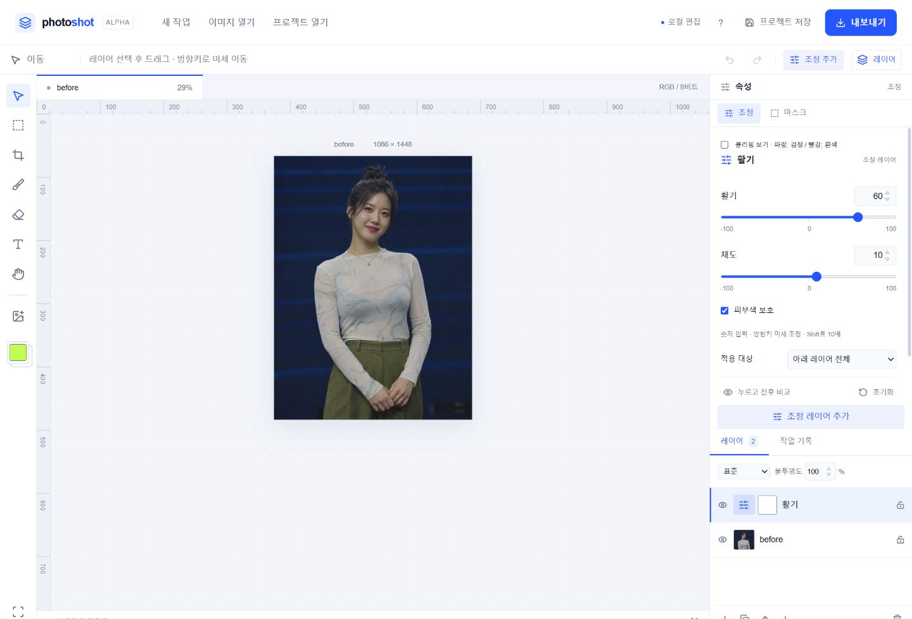

# 05 활기 · Vibrance

직접 만든 웹 사진 편집기 Photoshot에 활기 조정 레이어를 추가했습니다.

## 사용하기

1. 이미지를 열고 **조정 추가 → 활기**를 선택합니다.
2. 활기 +30부터 시작하고 +60으로 비교합니다.
3. 피부색 보호를 켠 상태에서 얼굴을 확인합니다.
4. 채도 +10을 더하고, 눈 아이콘이나 누르고 전후 비교로 확인합니다.

위 수치는 예시입니다. 피부, 입술, 배경을 함께 보며 조절하세요.

- 활기·채도: 각각 -100~100, 기본값 0.
- 피부색 보호: 기본 켜짐. 채도가 낮은 색과 피부의 반응을 구분하는 근사 방식입니다.
- 보호를 끄면 HSL 기반 반응을 사용합니다. 채도도 함께 반응이 바뀔 수 있습니다.
- 원본 레이어, 마스크, 불투명도, 혼합 모드, 클리핑, 실행 취소를 지원합니다.
- PNG/JPG 결과와 .layerstudio 프로젝트를 저장할 수 있습니다.

## 실행과 범위

Node.js 24에서 npm ci → npm run dev. 검증은 npm test, 빌드는 npm run build입니다.
누적 공개본에는 기본 도구·레이어·마스크와 02 레벨, 03 곡선, 04 노출, 05 활기가 포함됩니다.
RGB 8비트 공개 편집기이며 운영 사이트의 Camera Raw 등 다른 기능은 포함하지 않습니다.
측정 RGB 응답표와 보간은 독립 구현이며 Photoshop의 완전한 재현을 의미하지 않습니다.
이미지와 프로젝트는 브라우저 안에서 처리합니다. COPYRIGHT.md의 기존 이용 조건을 유지합니다.

[실제 보정 화면과 설명](https://slohero.com/photoshot/guides/vibrance/)

## English

Episode 05 adds Vibrance and Saturation (-100 to 100), with optional skin-tone protection.
Measured synthetic RGB responses are interpolated; Photoshop parity is not guaranteed. Protection-off uses an HSL response.
Masks, opacity, clipping, undo, project serialization and export use the shared compositor. Public source only, not an open-source license; see COPYRIGHT.md.
