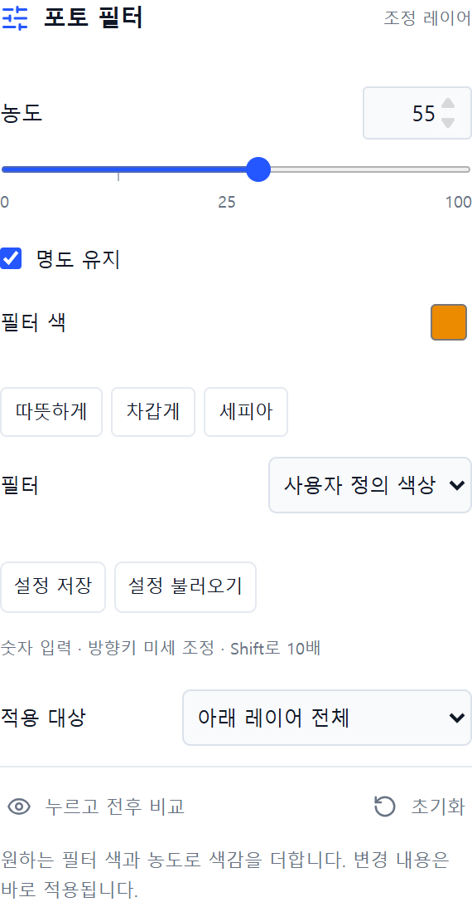

# 09 포토필터 · Photo Filter

직접 만든 웹 사진 편집기 Photoshot의 조정 레이어 공개 소스입니다. **v0.16.0 누적 버전**에 포함됩니다.

20개 필터 색상 선택, 사용자 색상, 농도와 명도 유지.

## 사용 순서

1. 이미지를 열고 **조정 추가 → 포토 필터**를 선택합니다.
2. Warming (85)를 선택하고 농도 35부터 비교합니다. 피부와 흰 옷의 색이 과하지 않은지 확인합니다.
3. **누르고 전후 비교** 또는 레이어 눈 아이콘으로 결과를 확인합니다.
4. 원본은 유지하고 PNG/JPG로 내보내거나, 편집을 계속하려면 `.layerstudio` 프로젝트로 저장합니다.

수치는 예시이며 모든 사진에 맞는 정답은 아닙니다. 마스크·불투명도·혼합 모드, 아래 레이어 전체/클리핑, 실행 취소와 설정 JSON 저장·불러오기를 사용할 수 있습니다.

위 이미지는 시리즈 제작 당시 Photoshot 화면입니다. 기능 설명용 캡처로, 공개본의 배치·테마와 일부 다를 수 있습니다.

## 조절 값

| 항목      | 범위    | 기본값 |
| --------- | ------- | ------ |
| 농도      | 0 ~ 100 | 25     |
| 명도 유지 | 0 ~ 1   | 1      |

## 실행과 구현

Node.js 24에서 `npm ci` → `npm run dev`. 검증은 `npm test`, 빌드는 `npm run build`입니다.

- [픽셀 처리](../src/adjustments.ts) · [패널](../src/adjustment-panel.tsx) · [추가 컨트롤](../src/advanced-adjustment.tsx)
- [전체 회차와 이용 조건](../README.md) · [웹에서 사용](https://slohero.com/photoshot/editor/)

Photoshop과 별개의 독립 구현이며 모든 이미지·색상 관리·비트 깊이에서 같은 결과를 보장하지 않습니다. RGB 8비트 작업 환경입니다. [COPYRIGHT.md](../COPYRIGHT.md)의 기존 이용 조건을 유지합니다.

## English

Episode 09: **Photo Filter**. Included in the cumulative v0.16.0 release. Open an image, add the adjustment, compare before/after, and export PNG/JPG or save a project. Masks, opacity, clipping, blending, undo and JSON presets use the shared editor. Processing runs locally in the browser. This independent implementation does not claim complete Photoshop parity. Public source only; no open-source license is granted to Photoshot's own code.
