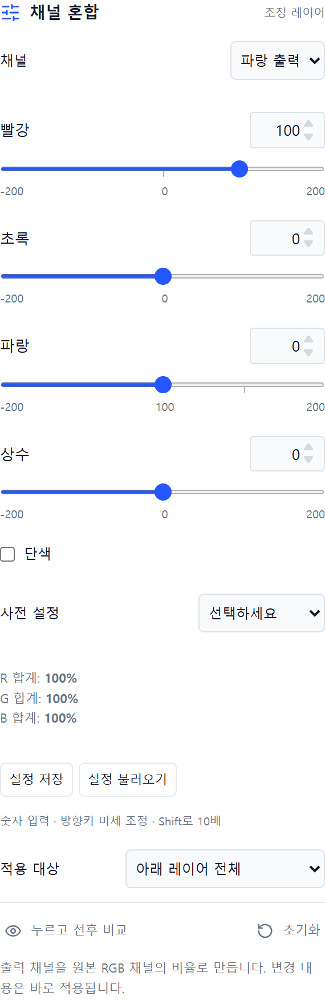

# 10 채널혼합 · Channel Mixer

직접 만든 웹 사진 편집기 Photoshot의 조정 레이어 공개 소스입니다. **v0.16.0 누적 버전**에 포함됩니다.

RGB 출력별 입력 채널 비율과 상수, 단색 모드, 합계 표시.

## 사용 순서

1. 이미지를 열고 **조정 추가 → 채널 혼합**를 선택합니다.
2. 빨강 출력에서 빨강 0·파랑 100, 파랑 출력에서 빨강 100·파랑 0을 적용해 채널 교환을 확인합니다.
3. **누르고 전후 비교** 또는 레이어 눈 아이콘으로 결과를 확인합니다.
4. 원본은 유지하고 PNG/JPG로 내보내거나, 편집을 계속하려면 `.layerstudio` 프로젝트로 저장합니다.

수치는 예시이며 모든 사진에 맞는 정답은 아닙니다. 마스크·불투명도·혼합 모드, 아래 레이어 전체/클리핑, 실행 취소와 설정 JSON 저장·불러오기를 사용할 수 있습니다.

위 이미지는 시리즈 제작 당시 Photoshot 화면입니다. 기능 설명용 캡처로, 공개본의 배치·테마와 일부 다를 수 있습니다.

## 조절 값

| 항목     | 범위       | 기본값 |
| -------- | ---------- | ------ |
| 빨강 (r) | -200 ~ 200 | 100    |
| 초록 (r) | -200 ~ 200 | 0      |
| 파랑 (r) | -200 ~ 200 | 0      |
| 상수 (r) | -200 ~ 200 | 0      |
| 빨강 (g) | -200 ~ 200 | 0      |
| 초록 (g) | -200 ~ 200 | 100    |
| 파랑 (g) | -200 ~ 200 | 0      |
| 상수 (g) | -200 ~ 200 | 0      |
| 빨강 (b) | -200 ~ 200 | 0      |
| 초록 (b) | -200 ~ 200 | 0      |
| 파랑 (b) | -200 ~ 200 | 100    |
| 상수 (b) | -200 ~ 200 | 0      |
| 단색     | 0 ~ 1      | 0      |

## 실행과 구현

Node.js 24에서 `npm ci` → `npm run dev`. 검증은 `npm test`, 빌드는 `npm run build`입니다.

- [픽셀 처리](../src/adjustments.ts) · [패널](../src/adjustment-panel.tsx) · [추가 컨트롤](../src/advanced-adjustment.tsx)
- [전체 회차와 이용 조건](../README.md) · [웹에서 사용](https://slohero.com/photoshot/editor/)

Photoshop과 별개의 독립 구현이며 모든 이미지·색상 관리·비트 깊이에서 같은 결과를 보장하지 않습니다. RGB 8비트 작업 환경입니다. [COPYRIGHT.md](../COPYRIGHT.md)의 기존 이용 조건을 유지합니다.

## English

Episode 10: **Channel Mixer**. Included in the cumulative v0.16.0 release. Open an image, add the adjustment, compare before/after, and export PNG/JPG or save a project. Masks, opacity, clipping, blending, undo and JSON presets use the shared editor. Processing runs locally in the browser. This independent implementation does not claim complete Photoshop parity. Public source only; no open-source license is granted to Photoshot's own code.
