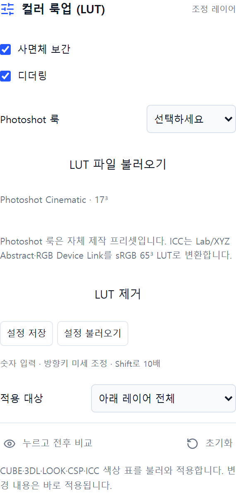

# 11 컬러룩업 · Color Lookup

직접 만든 웹 사진 편집기 Photoshot의 조정 레이어 공개 소스입니다. **v0.16.0 누적 버전**에 포함됩니다.

CUBE·3DL·LOOK·CSP·ICC/ICM 파일 읽기, 사면체/삼선형 보간과 디더링, 자체 제작 룩.

## 사용 순서

1. 이미지를 열고 **조정 추가 → 컬러 룩업 (LUT)**를 선택합니다.
2. Photoshot 룩에서 Warm Portrait를 선택하거나 LUT 파일 불러오기를 누릅니다. 적용 전후를 비교하고 레이어 불투명도로 강도를 조절합니다.
3. **누르고 전후 비교** 또는 레이어 눈 아이콘으로 결과를 확인합니다.
4. 원본은 유지하고 PNG/JPG로 내보내거나, 편집을 계속하려면 `.layerstudio` 프로젝트로 저장합니다.

수치는 예시이며 모든 사진에 맞는 정답은 아닙니다. 마스크·불투명도·혼합 모드, 아래 레이어 전체/클리핑, 실행 취소와 설정 JSON 저장·불러오기를 사용할 수 있습니다.

위 이미지는 시리즈 제작 당시 Photoshot 화면입니다. 기능 설명용 캡처로, 공개본의 배치·테마와 일부 다를 수 있습니다.

## 조절 값

| 항목        | 범위  | 기본값 |
| ----------- | ----- | ------ |
| 사면체 보간 | 0 ~ 1 | 1      |
| 디더링      | 0 ~ 1 | 0      |

## LUT·ICC 지원 범위

- CUBE: 1D, 3D, 1D+3D 및 입력 범위. 3D 격자는 2³~65³, 파일은 최대 32MB.
- 3DL: 격자·채널 순서와 출력 비트 깊이 처리. LOOK: 지원하는 XML 내 little-endian float LUT. CSP: 1D/3D와 입력 곡선. 모든 업체 확장 포맷을 보장하지는 않습니다.
- ICC/ICM: Lab/XYZ Abstract와 RGB→RGB Device Link만 지원합니다. 일반 모니터·프린터 프로파일은 컬러룩업용 파일이 아닙니다.
- LittleCMS 2.16으로 sRGB 65³ LUT를 생성합니다. RGB 8비트 편집 환경이며 Adobe 색상 관리 전체와 동일하지 않습니다.
- 기본 룩 Neutral, Warm Portrait, Cool Shadows, Soft Film은 Photoshot 자체 제작입니다. Adobe의 유료 LUT를 배포하지 않습니다.
- [검사용 LUT 예제](examples/identity.cube)와 [RGB 교환 LUT](examples/swap-rb.cube)를 함께 제공합니다.

## 실행과 구현

Node.js 24에서 `npm ci` → `npm run dev`. 검증은 `npm test`, 빌드는 `npm run build`입니다.

- [픽셀 처리](../src/adjustments.ts) · [패널](../src/adjustment-panel.tsx) · [추가 컨트롤](../src/advanced-adjustment.tsx)
- [전체 회차와 이용 조건](../README.md) · [웹에서 사용](https://slohero.com/photoshot/editor/)

Photoshop과 별개의 독립 구현이며 모든 이미지·색상 관리·비트 깊이에서 같은 결과를 보장하지 않습니다. RGB 8비트 작업 환경입니다. [COPYRIGHT.md](../COPYRIGHT.md)의 기존 이용 조건을 유지합니다.

## English

Episode 11: **Color Lookup**. Included in the cumulative v0.16.0 release. Open an image, add the adjustment, compare before/after, and export PNG/JPG or save a project. Masks, opacity, clipping, blending, undo and JSON presets use the shared editor. Processing runs locally in the browser. This independent implementation does not claim complete Photoshop parity. Public source only; no open-source license is granted to Photoshot's own code.
