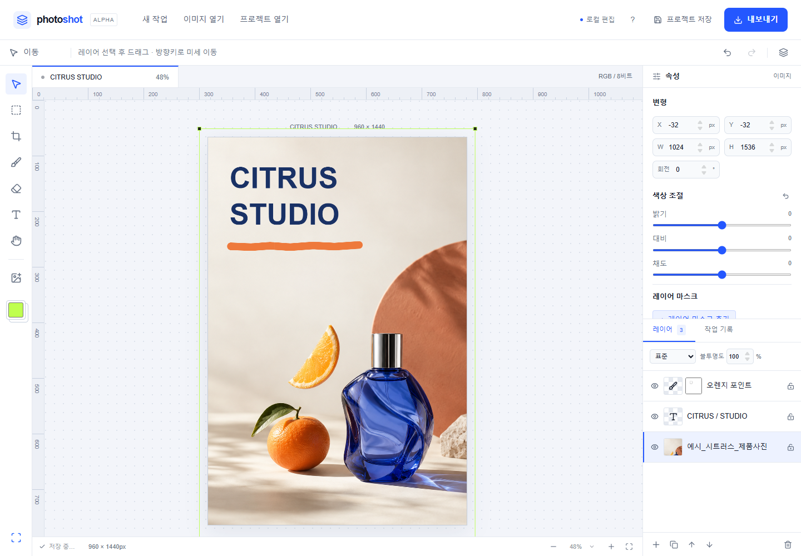

# Photoshot · 01 기본 도구, 레이어와 마스크

브라우저에서 사진을 열고, 글자를 더하고, 레이어와 마스크로 편집하는 무료 웹 사진 편집기입니다.
Photoshot을 만드는 과정을 코드와 사용 화면으로 공개합니다.

**[Photoshot 사용하기](https://slohero.com/photoshot/) · [편집기 바로 열기](https://slohero.com/photoshot/editor/) · [01 도구별 사용법과 작업기](https://slohero.com/photoshot/guides/basic-tools/)**



> 이 저장소는 **01 기본 도구 버전**의 소스 공개본입니다. 조정 레이어 16종과 AI 레이어 분리는 포함하지 않습니다.
> 현재는 **코드 공개만 진행**하며, 오픈소스 라이선스는 부여하지 않았습니다. 이용 조건은 [COPYRIGHT.md](../COPYRIGHT.md)를 확인하세요.

## 무엇을 할 수 있나요?

| 도구          | 사용 방법                                                 |
| ------------- | --------------------------------------------------------- |
| 이미지 열기   | PNG·JPG·WebP 파일을 열거나 작업 화면에 끌어놓기           |
| 이동·변형     | 레이어를 드래그하고 위치·너비·높이·회전값 조절            |
| 자르기        | 영역을 드래그한 뒤 **자르기 적용**                        |
| 문자          | 캔버스를 클릭해 글자를 추가하고 내용·크기·색상 변경       |
| 브러시·지우개 | 선택한 레이어에 그리거나 지우기                           |
| 레이어        | 추가·복제·삭제·순서 변경·숨기기·잠금·불투명도·혼합 모드   |
| 레이어 마스크 | 원본을 유지하면서 브러시로 숨기기·복원, 마스크 반전·끄기  |
| 선택 영역     | 사각형 선택 영역으로 레이어 마스크 만들기                 |
| 저장          | PNG·JPG 내보내기와 `.layerstudio` 프로젝트 저장·다시 열기 |

개별 레이어의 기본 밝기·대비·채도 조절도 포함됩니다. 별도의 **조정 레이어** 기능과는 다릅니다.

## 내 컴퓨터에서 실행하기

Node.js **24 LTS 권장**(최소 22.13.0)과 npm이 필요합니다. 아래 명령은 로컬 실행 절차입니다.

```sh
git clone https://github.com/dodohan0721/photoshot.git
cd photoshot
npm ci
npm run dev
```

터미널에 표시되는 로컬 주소를 여세요. 기본 주소는 `http://127.0.0.1:5173`입니다.
서버·API 키·GPU 설정 없이 브라우저에서 실행됩니다.

```sh
npm test       # 마스크 숨기기/복원, 비파괴 편집, 합성, 프로젝트 복원 검증
npm run build  # TypeScript 검사 및 정적 빌드
npm run preview
```

`npm run build` 결과는 `dist/`에 생성됩니다. HTML 파일을 직접 더블클릭하지 말고 개발 서버 또는 미리보기 서버로 열어주세요.

## 사용법

[도구별 빠른 사용법](basic-tools.md) · [사진으로 보는 전체 작업기 01](https://slohero.com/photoshot/guides/basic-tools/)

- `V`: 이동 / `M`: 사각형 선택 / `C`: 자르기
- `B`: 브러시 / `E`: 지우개 / `T`: 문자 / `H`: 손 도구
- `0`: 화면에 맞추기
- `Ctrl/Cmd + Z`: 실행 취소 / `Ctrl/Cmd + Shift + Z`: 다시 실행
- `Ctrl/Cmd + S`: 프로젝트 저장 / `Ctrl/Cmd + D`: 레이어 복제

## 데이터와 지원 범위

- 이미지 편집은 브라우저 안에서 처리합니다. 이 소스에는 이미지 업로드 서버나 분석 추적 코드가 없습니다.
- 작업은 현재 브라우저의 IndexedDB에 자동 저장됩니다. 브라우저 데이터가 지워지면 사라질 수 있으므로 `.layerstudio` 파일도 저장하세요.
- 독립 공개본은 `photoshot-01` 저장 공간을 사용하므로 기존 서비스의 자동 저장 문서를 덮어쓰지 않습니다.
- RGB 8비트, 캔버스 한 변 최대 4096px, 최대 50개 레이어를 지원합니다. 이미지 입력은 파일당 최대 25MB입니다.
- PSD·RAW·CMYK, 조정 레이어, AI 레이어 분리는 이 버전에 포함되지 않습니다. 다른 버전의 조정 레이어가 들어간 프로젝트는 열 수 없습니다.
- 레이어 미리보기는 PixiJS/WebGL을 사용합니다. 하드웨어 가속을 사용할 수 있는 데스크톱 브라우저를 권장합니다.
- 폰트·브라우저·혼합 모드에 따라 미리보기와 결과에 차이가 있을 수 있습니다. 저장된 PNG/JPG를 확인하세요.
- 이 저장소는 사용법 01의 기본 기능을 독립 실행하도록 정리한 공개본이며, 전체 SLOHERO 홈페이지나 운영 서버 구성은 포함하지 않습니다.

## 코드 구성

```text
src/editor.tsx     도구, 속성 패널, 레이어 목록, 실행 취소와 파일 처리
src/document.ts   문서 형식, 레이어·마스크 합성, 저장과 불러오기
src/stage.tsx      PixiJS 기반 편집 화면
src/styles.css    편집기 공통 스타일
src/theme.css     밝은 테마
```

브랜드 표시는 Photoshot으로 정리하고, 기존 프로젝트와의 호환성을 위해 `.layerstudio` 파일명과 문서 식별자는 유지했습니다.
독립 실행본은 시스템 글꼴을 사용합니다.

## 권리 및 문의

Photoshot 고유 소스에 오픈소스 라이선스를 부여하지 않았습니다. [권리 안내](../COPYRIGHT.md)와 [외부 구성요소](../THIRD_PARTY_NOTICES.md)를 참고하세요.
Photoshot은 Adobe Photoshop과 별개의 독립 프로젝트입니다.

버그를 발견하면 GitHub Issues에 재현 과정과 브라우저 정보를 남겨주세요. 개인 사진이나 비밀 정보는 첨부하지 마세요.
제작: [SLOHERO](https://slohero.com/)

---

## English

**Photoshot** is a free browser-based photo editor with text, painting, cropping, layers and non-destructive layer masks.
This repository publishes the **Episode 01** source snapshot. It runs locally with React, TypeScript, Vite and PixiJS; no backend, API key or GPU worker is required.

**[Try Photoshot](https://slohero.com/photoshot/) · [Visual guide](https://slohero.com/photoshot/guides/basic-tools/)**

Use Node.js 24, run `npm ci`, then `npm run dev`. `npm test` checks masks and compositing; `npm run build` type-checks and builds the static app.
Standalone adjustment layers and AI layer separation are not part of this version.

**Public source, no open-source license granted.** See [COPYRIGHT.md](../COPYRIGHT.md). Third-party dependencies retain their own licenses.
